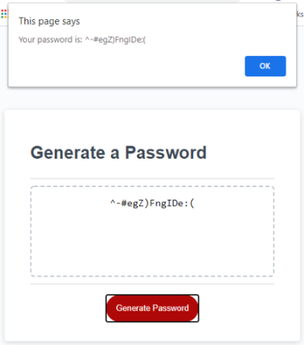

# Project Title: Password Generator
___
## Objective
Create an application that generates a random password based on user-selected criteria. The application will run in the browser and feature dynamically updated HTML and CSS powered by JavaScript code. It will also feature a clean and polished user interface and be responsive, ensuring that it adapts to multiple screen sizes.

The user clicks the **Generate Password** button to generate a password.
The password criteria are:
- The user is prompted to select the length of the password between **8** and **128** characters.
The user must select at least **1** of the **4** groups of characters listed below:
- **lower case letters**
- **upper case letters**
- **numeric characters**
- **password special characters** (https://www.owasp.org/index.php/Password_special_characters)

A password is then generated that matches the selected criteria options.  The password is displayed in an alert window or written to the web page.
___
## Layout: index.html
The **passwordStart()** was added to the onclick event of the **Generate Password** button to call the function in JavaScript when the button is pressed.

## Layout: script.js
The 4 sets of characters defined in the Objective criteria were declared as strings: **lowerChars**, **upperChars**, **numericChars**, and **specialChars**.  The **specialChars** string had to be divided into 2 strings (specialChars1 and specialChars2) to include the double quote ("), and the back slash(\\). The 2 strings were concatenated, and the **substring()** method was used to extract the full set of special characters excluding the second back slash.  The following functions were then called to generate a password:
- The **passwordStart()** function was used to reset the **password** and **criteriaChars** variables assigned to empty strings; **passLength** variable assigned to 0; **passCriteria** variable assigned to an empty array, and **console.clear()** function to clear the console so that execution of the code could be easily viewed.
- The **getPassLength()** function was used to ask the user for a numeric, whole number entry for the password length.  A while loop was used to reject the entry if it was not a number, the entry  included a decimal point, the number was less than 8, or if the number was greater than 128.  The **passLength** variable was then converted to an integer.
- The **getPassCriteria()** function was used to confirm if the user wanted to incorporate the 4 sets of characters identified in the password criteria.  A while loop checked if all 4 of the **confirm()** methods were false, and the function repeated.
- The **generateCriteria()** function was used to build a string of characters from the criteria list selected as true in the **getPassCriteria** function. The string variable, **criteriaChars**, contained this string.  A for loop was run with  **i < passLength** as the condition.  For each **i** iteration, a random character was added to **password** using the formula: 
**password = password + criteriaChars.charAt(Math.floor(Math.random() * criteriaChars.length))**.
The password was then sent to the index.html **textarea** using the **getElementById()** method: 
**document.getElementById("password").value = password**
The password was also displayed using the **window alert()** method:
**alert("Your password is: " + password)**

## Challenges:
I could not get the **password** to display in the textarea of the index.html document until after selecting **OK** on the alert window.  A person with the identity (iarcones) on the Ask BCS Learning Assistant told me this is a common issue when using alerts.  They informed me to use the **setTimeout(())** method before the line of code calling the **window alert()** method and it solved the problem.
___
## Summary
Password generation plays a vital role in society today as more people rely on the internet to perform personal and business activities.  There will always be hackers trying to disrupt these activities.  This application could be used in both personal and business environments.  Those individuals who find difficulty creating passwords without using personal words or dates could find it useful.  Also, businesses that need to send multiple temporary passwords to their customers via email could recognize this application as a more effective approach if their use has a brief time expiration.
___
## Application Links and Images:
**Links:**
Application link: [Password Generator](https://ed-sivick.github.io/3-password_generator/Develop/index.html)
index.html code: [index.html]https://github.com/ed-sivick/3-password_generator/blob/master/Develop/index.html
JavaScript.js code: [script.js]https://github.com/ed-sivick/3-password_generator/blob/master/Develop/script.js
style.css code: [style.css]https://github.com/ed-sivick/3-password_generator/blob/master/Develop/style.css

**Image Examples:**

  
  
  

